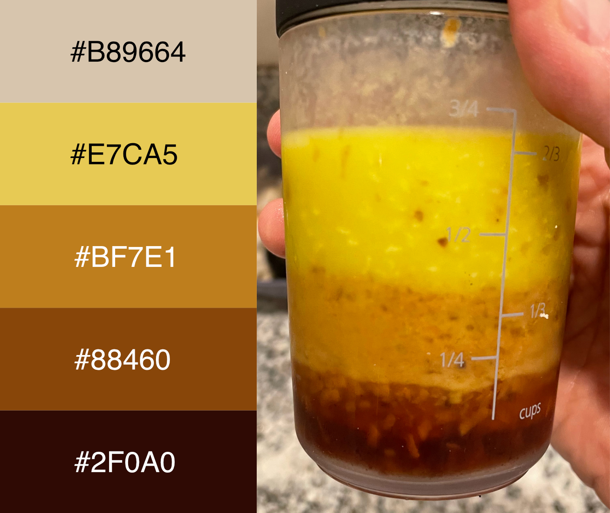

# Salad Dressing Color Palette

This repository contains a color palette based on some homemade salad dressing. 

`ggplot2` compatible `scale_*_dressing()` functions are available in the `./R/` directory along with some example code. 

